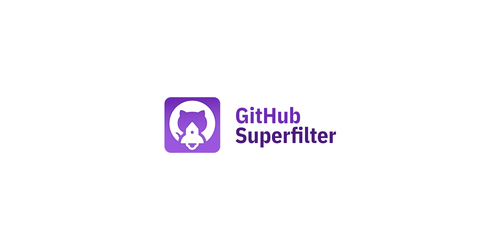
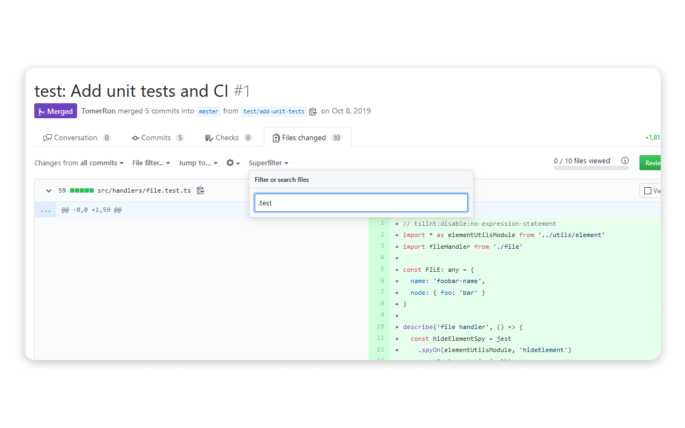

[](#)

🚀 GitHub Superfilter is a web extension that adds a lovely filter to GitHub pull requests.

[](https://travis-ci.org/TomerRon/github-superfilter)

[](https://addons.mozilla.org/en-US/firefox/addon/github-superfilter/) [](https://chrome.google.com/webstore/detail/github-superfilter/kfpophkefjclocneelejpjbpkmboepfb)

- [Why use GitHub Superfilter?](#why-use-github-superfilter)
- [Installation](#installation)
- [Development flow](#development-flow)
- [Build flow](#build-flow)
- [Contributors](#contributors)
- [License](#license)

## Why use GitHub Superfilter?

GitHub's default filter sucks! It only allows to filter by file extension, and it doesn't properly handle files with multiple extensions (like `.test.js`)

On the other hand, GitHub Superfilter is awesome!

🎉 It gives you more control over how you filter your pull requests. You can search for files in a specific folder (`/components/`), or with a specific extension (`.test.js`). You can also filter out files (`!/src/` or `!test`)

🎉 It's lightweight (< 4KB), only runs on github.com, and does not make your browser slower

🎉 It helps you become a better developer by making your life just a little bit easier

[](#)

## Installation

Download the [Firefox add-on](https://addons.mozilla.org/en-US/firefox/addon/github-superfilter/) or the [Chrome extension](https://chrome.google.com/webstore/detail/github-superfilter/kfpophkefjclocneelejpjbpkmboepfb).

## Development flow

Clone this repository, and install the dependencies:

```
git clone https://github.com/TomerRon/github-superfilter
cd github-superfilter
yarn
```

Run the unit tests:

```
yarn test
```

Watch the files:

```
yarn watch
```

Start a temporary Firefox session with the add-on installed.
The session uses a new profile that is destroyed after Firefox is closed.

```
yarn start:sandbox
```

Start a temporary Firefox session with the add-on installed.
Use the standard (default) Firefox profile, which shares session/cookies with other windows.

```
yarn start
```

**Note**: If you are having issues running `yarn start`, you can also navigate to `about:debugging` in Firefox, press `Load Temporary Add-on` and select the `dist/manifest.json` file.

## Build flow

Create a build:

```
yarn build
```

Or, create a build and zip it (useful for GitHub/Firefox/Chrome releases):

```
yarn build-release
```

## Contributors

Huge shoutout to [fivenp](https://fivenp.com/) ([@fivenp](https://github.com/fivenp)) for the amazing assets. Go check out his work!

## License

This project is licensed under the ISC License - see the [LICENSE.md](LICENSE.md) file for details.
